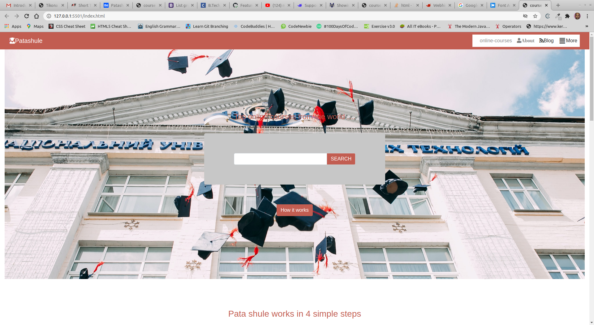
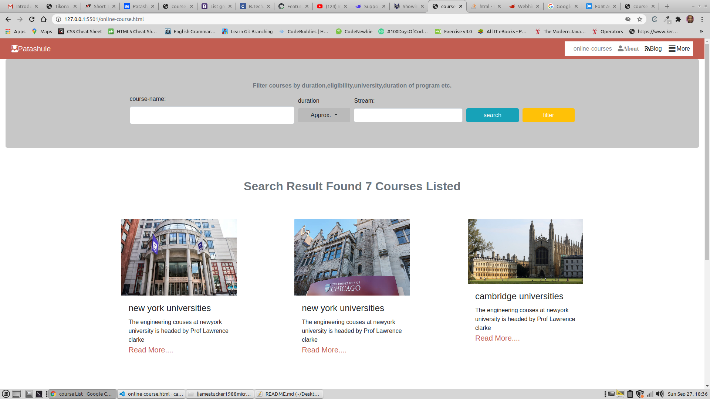
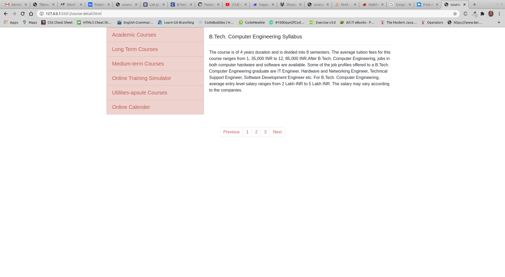

# Project - Capstone Project

​
This is an assigned project where I am supposed to create a search website for online ourses .

​
​

## Preview of our webpage

### Index Page

​

### Online-course page

### Course-detail page

​

## Built With

- HTML5
- CSS3
- Google icons (https://www.w3schools.com/icons/icons_reference.asp)
- fontawesome icons (https://fontawesome.com/)
  ​

## Live Demo of my project

<a href="https://raw.githack.com/jamestucker1988/capstone/feature/index.html" >click here-index.html</a>
<a href="https://raw.githack.com/jamestucker1988/capstone/feature/online-course.html">click here-onlinecourse.html</a>
<a href="https://raw.githack.com/jamestucker1988/capstone/feature/course-detail.html">click here-course-detail.html</a>

## Authors

👤 **Anand Kumar**
​

- Github: [@jamestucker1988](https://github.com/jamestucker1988)
- Twitter: [anandku74070598](https://twitter.com/anandku74070598)
- Linkedin: [Anand Kumar](https://linkedin.com/in/anand-kumar-9128)
  ​

## Contributiors

​
Contributions, issues and feature requests are welcome!
​
Feel free to check the [issues page](https://github.com/jamestucker1988/Embedding-images-in-video/issues).
​

## Show your support

​
Give a ⭐️ if you like this project!
​

## Acknowledgments

- Hat tip to anyone whose code was used
- Inspiration
- etc
  ​

## License

​
This project is [MIT](lic.url) licensed.
